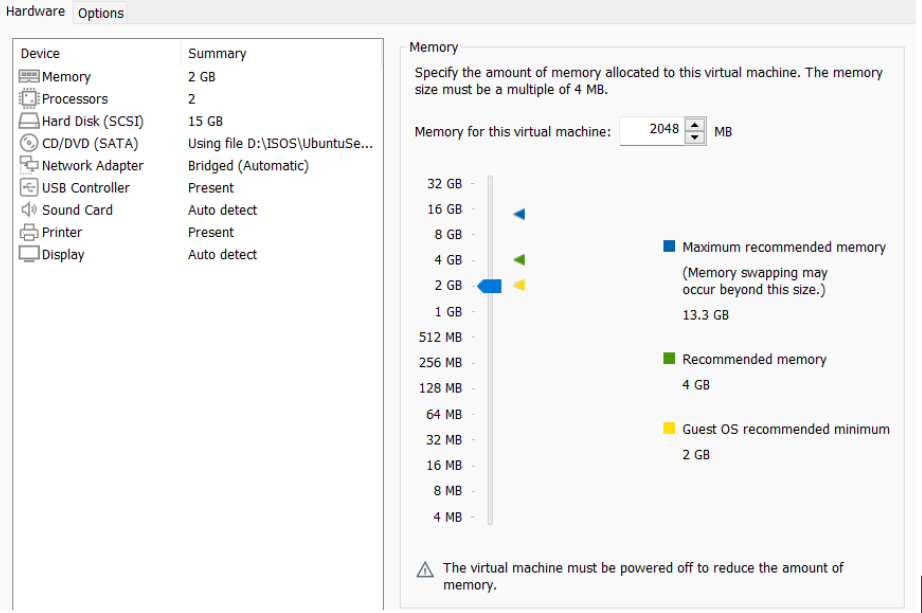
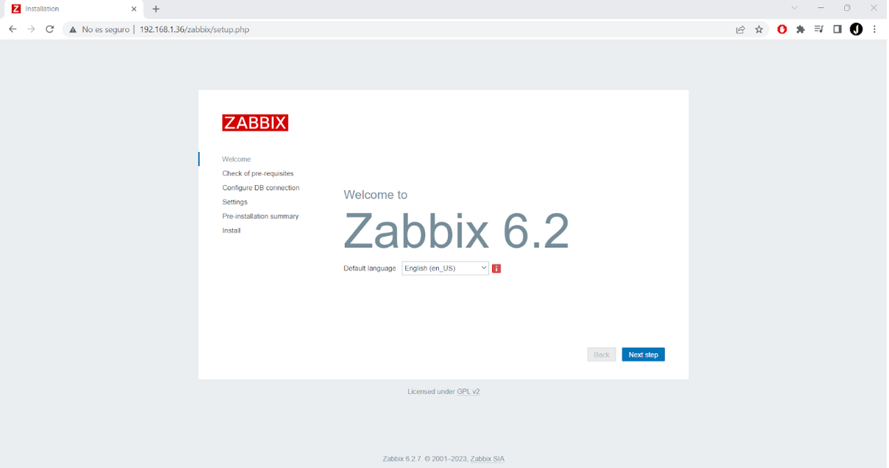

# Monitorización con Pandora FMS

# 1. ¿Qué es la monitorización?

 La monitorización es el proceso de supervisión y control de un sistema, proceso o actividad para medir su rendimiento y detectar cualquier desviación o problema. Esto puede incluir el uso de tecnologías y herramientas para recopilar y analizar datos en tiempo real, para garantizar que se cumplan los objetivos y se mantengan los estándares deseados.

Algunas de las razones por las que la monitorización de sistemas es un		elemento imprescindible al servicio de administración de sistemas son la siguientes:

* **Notificación de errores:** Alarmas que avisan cuando algo no 		funciona bien o cuando algo corre el riesgo de llegar a un punto de fallo.	

*  **Conocimiento del rendimiento:** Conocer en detalle el rendimiento de tus servicios.
* **Sistema centralizado de logs:** Los logs son imprescindibles para buscar errores y fallos, lo mejor es contar con un sistema centralizado de logs y si es uno en tiempo real, mejor que mejor.
* **Detección de incidencias:** Permite detectar el origen de las incidencias.
* **Optimización de sistemas:** Las estadísticas que obtienes gracias a estas herramientas darán con el paso del tiempo una visión de cuando suben o bajan tus necesidades. Gracias a estos datos, podrás anticiparte y optimizar tus sistemas en el futuro.
* **Competitividad y eficiencia:** Unida al mantenimiento y la administración de sistemas, la monitorización 24/7 permite aumentar la eficiencia y ahorrar costes.

 # 2.1 Pandora FMS
 ## 2.1.1  Historia

Pandora FMS es un sistema de monitoreo de infraestructura IT flexible y potente desarrollado por Pandora Software. Fue fundado en el año 2002 en España con el objetivo de proveer una herramienta de monitoreo de sistemas que pudiera adaptarse a las necesidades de cualquier tipo de organización.

A lo largo de los años, Pandora FMS ha sido ampliamente adoptado y ha crecido hasta convertirse en uno de los sistemas de monitoreo más populares del mercado, con una amplia base de usuarios que incluye a empresas de todos los tamaños y sectores. La plataforma es conocida por su flexibilidad y capacidad para monitorear una amplia gama de dispositivos y servicios, incluyendo servidores, redes, aplicaciones, almacenamiento y dispositivos IoT.

El éxito de Pandora FMS se debe en gran parte a su enfoque en la satisfacción del cliente y su compromiso constante con la mejora continua y el desarrollo de nuevas funciones y capacidades. Hoy en día, Pandora FMS sigue siendo un líder en su campo y una herramienta valiosa para cualquier organización que busque monitorear y optimizar su infraestructura IT.

 ## 2.1.2  Funciones y características. Ventajas y desventajas

Entre sus características destacan:

* Monitoriza sistemas, aplicaciones o dispositivos de red. 
* Permite conocer el estado de cada elemento de un sistema a lo largo del tiempo ya que dispone de histórico de datos y eventos.
* Está orientado a grandes entornos
*Permite gestionar con y sin agentes, varios miles de sistemas, por lo que se puede emplear en grandes clusters, centros de datos y redes de todo tipo.

## 2.1.3   Plataformas.
**Servidor.**

Pandora FMS puede recoger información de cualquier sistema operativo con
agentes específicos para cada plataforma, que recojan los datos y los envíe al servidor.
Pandora FMS es una herramienta muy buena para usar, ya que no tienes que
preocuparte en que sistema operativo tengas, puedes usarlo en cualquiera.
También cabe decir que la mejor plataforma para su uso es CentOS, que será la
plataforma que nosotros hemos escogido.

**Agentes.**

Los agentes de Pandora FMS son entidades organizativas, generalmente un
ordenador. Los agentes tienen la información, y pertenecen a un solo grupo. El agente resguarda información en diferentes módulos y bien puede estar relacionado con otros agentes, mediante una o varias relaciones de parentesco. Los agentes son, por tanto, unidades organizativas dentro de Pandora FMS, un concepto donde se deposita información de otras unidades de información llamadas módulos.
Hay agentes específicos para cada sistema operativo, por ejemplo, para
GNU/Linux, AIX, Solaris, MAC OSX y cualquier sistema Windows a partir del Windows 2000. Los módulos pueden ser remotos y locales.
Módulos remotos.
Se comunican mediante protocolos o tecnologías con plugins.
Algunos son:
* Módulos de red: TCP, ICMP
* Plugins para MySQL, PostgreSQL, etc.

**Módulos locales.**

Son módulos que se ejecutan en el mismo ordenador que supervisan, en realidad son guiones o scripts escritos en diferentes lenguajes como bash, Perl, Python e inclusive programas específicos que, desde luego, deben estar previamente instalados para que puedan ser indagados, capturada su respuesta y enviarlos al servidor correspondiente que esté ejecutando Pandora FMS.

# 2.1.4 Requisitos minimos
**Requisitos mínimos.**

En este apartado veremos los requisitos mínimos de hardware que emplearemos para la instalación de Pandora FMS (dependiendo de la cantidad de
módulos estimados que se vayan a utilizar, el servidor puede ser de tamaño pequeño, mediano, grande o extra grande).

**Requisitos recomendados**

 ## 2.1.5  Esquema de Red y Entorno
 El esquema de red con el que nosotros vamos a trabajar es el siguiente:
 

El entorno que vamos a necesitar para instalar Pandora FMS y la monitorización de los agentes es el siguiente:

**Server Pandora FMS**

* Sistema Operativo: CentOS
* Red: 192.168.112.0/24
* Dirección IP: 192.168.112.212

**Agente**
* Sistema Operativo: Windows Server 2016
* Red: 192.168.112.0/23
* Dirección IP: 192.168.112.230
  
## 2.1.6  Instalación y configuración Pandora FMS
* Servidor
  
Una vez arrancada la maquina con la ISO de Pandora FMS procedemos a hacer al instalación.

Seleccionamos el lenguaje.

Aqui podemos ver el resumen particionado del disco:

Por último definimos la contraseña del superusuario:

Esperemos a que finalice la instalacion y accedemos desde el navegador con la ip que nos proporciona:

Aquí vemos una vista de cómo es la herramienta desde el navegador. Por defecto PandoraFMS tiene un usuario y contraseña estándar al realizar la instalación que luego habrá que modificar por motivos de seguridad.

Nos logueamos con el usuario admin y contraseña pandora.

## 2.1.7  Instalación y configuración en agentes 

* Agente

Descargamos el instalador del agente en el servidor y procedemos a la configuración. Introducimos la IP de Servidor Pandora.

Nos vamos al servidor Pandora, y vemos que ya se ha instalado el agente y podemos monitorizarlo desde el panel de Pandora.

## 2.1.9  Puesta en marcha (pruebas) y ejemplo de uso.

Para las pruebas voy a ver el registro de eventos de Windows que no requiere instalación.
Instalación de nfdump:

Ejecutaremos la siguiente orden para comprobar que las funciones están instaladas:

Activamos NetFlow:

Prueba de registro de eventos en Windows Server Agente. Podemos ver los eventos en el servidor y en el agente:

Para ello iremos a la pestaña recursos y en gestión de agentes seleccionamos Windows y aparecerá un gráfico como vemos en la captura de arriba. Podemos ver todos los eventos que se han producido en las últimas horas fraccionando estos en eventos normales, críticos o advertencias. Ahora veremos los eventos del agente Windows:

 # 2.2 Zabbix
 ## 2.2.1  Historia

Zabbix es un software de monitoreo de sistemas y aplicaciones de código abierto. Fue creado por Alexei Vladishev en Latvian Institute of Applied Sciences en 2001. Inicialmente, se desarrolló como una solución de monitoreo para el Centro de Cálculo de la Universidad de Latvian. Con el tiempo, se ha expandido y mejorado, y ahora es utilizado en todo el mundo para monitorear una amplia variedad de sistemas, incluyendo servidores, redes, aplicaciones y servicios en la nube. Zabbix se caracteriza por su escalabilidad, flexibilidad y capacidad de integrarse con una amplia variedad de tecnologías.

 ## 2.2.2  Funciones y características. Ventajas y desventajas

Entre sus características destacan:

* Verificar la disponibilidad y nivel de respuesta de varios servicios como por ejemplo servicios web o de correo.
* Permite obtener estadísticas cómo carga de una CPU, uso de disco, ancho de banda de la red…
* Permite monitorizar servicios a través de protocolos como SNMP, TCP, ICMP o SSH y telnet.

## 2.2.3   Plataformas.
**Servidor.**

Además de los paquetes y dispositivos oficiales existentes, Zabbix 5.0 ahora también se adapta a las siguientes plataformas: SUSE Linux Enterprise Server 15, Debian 10, Ubuntu 20.04, Raspbian 10, Mac OS / X, RHEL 8, CentOS 8, y MSI para Windows Agent.

# 2.2.4 Requisitos minimos
**Requisitos mínimos.**

 ## 2.5  Esquema de Red y Entorno
 El esquema de red con el que nosotros vamos a trabajar es el siguiente:
 

El entorno que vamos a necesitar para instalar zabbix y la monitorización de los agentes es el siguiente:

**Server zabbix**
* Sistema Operativo: Ubuntu
* Red: 192.168.1.0/24
* Dirección IP: 192.168.1.40

**Agente**
* Sistema Operativo: Windows Server 2016
* Red: 192.168.1.0/23
* Dirección IP: 192.168.1.43
  
## 2.2.6  Instalación y configuración en máquinas a monitorizar.
**Servidor**  
Voy a usar un servidor de ubuntu con las siguientes caracteristicas para montar zabbix

**Instalación del paquete**  
Primero para poder instalar zabbix en ubuntu server tenemos que descargarlo de la página oficial y descomprimirlo que lo hacemos con los siguientes comandos.  
* wget https://repo.zabbix.com/zabbix/6.2/ubuntu/pool/main/z/zabbix-release/zabbix-release_6.2-4%2Bubuntu22.04_all.deb
* dpkg -i zabbix-release_6.2-4+ubuntu22.04_all.deb
* apt update
* apt install zabbix-server-mysql zabbix-frontend-php zabbix-apache-conf zabbix-sql-scripts zabbix-agent  

**Creación base de datos inicial**  
Debemos crear una base de datos inicial para poder configurar zabbix para ello podemos seguir los siguientes pasos.
Tenemos que crear un servidor de base de datos, en mi caso voy a usar mysql.
Una vez tenemos mysql iniciamos sesión con root y creamos la siguiente base de datos.
* mysql> create database zabbix character set utf8mb4 collate utf8mb4_bin;
* mysql> create user zabbix@localhost identified by 'password';
* mysql> grant all privileges on zabbix.* to zabbix@localhost;
* mysql> set global log_bin_trust_function_creators = 1;
* mysql> quit;

En el servidor Zabbix, importamos el esquema y los datos iniciales con el siguiente comando.
* zcat /usr/share/zabbix-sql-scripts/mysql/server.sql.gz | mysql --default-character-set=utf8mb4 -uzabbix -p zabbix

**Configurar la base de datos para el servidor Zabbix**  
Editar archivo /etc/zabbix/zabbix_server.conf  
Y configuramos la contraseña que le pusimos al usuario creado anteriormente en la base de datos.

**Inicia los procesos del agente y del servidor Zabbix**  
Inicia los procesos del agente y del servidor Zabbix y configurarlos para que se inicien con el sistema. Para ello usamos los siguientes comandos.
* systemctl restart zabbix-server zabbix-agent apache2
* systemctl enable zabbix-server zabbix-agent apache2

**Configuración de zabbix**  
Entramos a la dirección ip de nuestro servidor.

Ahora configuramos zabbix con la base de datos que hemos creado anteriormente.  

Y una vez lo configuramos ya podemos iniciar sesión.  

## 2.2.7  Instalación y configuración en agentes 
Para la instalacion de un agente Zabbix lo que hemos instalado ha sido un Windows Server 2016 con las siguientes caracteristicas:

El siguiente paso seria instalarnos el agente Zabbix:

## 2.2.9  Puesta en marcha (pruebas) y ejemplo de uso.
A continuacion vamos a realizar las pruebas de un agente con Zabbix.

Aqui podemos ver que ya hemos incorporado nuestro agente.

Y aqui nos muestra si hay algun error y como esta funcionando nuestro agente.

 # 3.  Conclusiones y problemas encontrados 

Para el entorno que nosotros hemos creado, los recursos que necesitamos son simples.
En una empresa con más cantidad de módulos se necesitan más recursos hardware, dependiendo de la cantidad de equipos que la empresa disponga.

La implementación de un servidor Pandora FMS requiere solamente de un servidor y unos agentes con hardware económico que casi todo el mundo puede permitirse.

Pandora FMS es muy fácil de implementar. Simplemente es descargar la ISO que viene de Pandora para CentOS e instalarla. Tiene un modo de instalación gráfico lo que lo hace muy intuitivo y no tiene pérdida.

Además, Pandora FMS es muy fácil de utilizar. Es una herramienta donde controlas todo a través de su consola de administración. Todo está muy bien distribuido y es fácil acceder a ello, por si tienes alguna duda Pandora FMS cuenta con manuales de la mayoría de las cosas, para que todo sea mucho más fácil y puedas realizar cualquier operación. Es una muy buena herramienta ya que te deja libertad para hacer muchísimas cosas.

Lo que más nos ha gustado de la herramienta son las herramientas que tiene. Sobre todo cuando las comparas con las demás, que no te dejan tanta libertad.

Lo único que podemos decir malo de esta herramienta es que en la versión gratuita no incluye todas las herramientas posibles, por lo que tendríamos que pagar si queremos usar todas sus funciones.

 # 4.  Comparativa con Zabbix

Zabbix y Pandora FMS son herramientas bastante parecidas y completas, sin embargo, Pandora parte con una desventaja bastante importante para usuarios nuevos con la herramienta. Esta desventaja es que Zabbix tiene detrás una gran comunidad que comparte sus errores y soluciones a problemas haciendo así la configuración y uso más fácil, mientras que Pandora es una herramienta más nueva y por lo tanto no cuenta con el mismo número de usuarios ayudándose entre ellos, por lo que cualquier fallo que encuentras en la configuración es solo tuyo y lo tienes que solucionar por ti mismo, la única solución es mirar en la información oficial de Pandora, la cual es bastante extensa y completa. 

Además, la configuración de Pandora se hace a través de archivos, tocando determinados parámetros, mientras que Zabbix se puede configurar de manera gráfica, haciendo la configuración más intuitiva y “sencilla”. 

 # 5  Bibliografía

# ANEXO. Desarrollo del proyecto con SCRUM
## I. Equipo y roles
## II. Reuniones realizadas (events)
## III. Documentos: 
- link al backlog del equipo  -- no olvidar compartir con mctripiana@iesgrancapitan.org --
- Añadir (compartir en drive, link) cualquier otro documento que sea necesario
           
           
